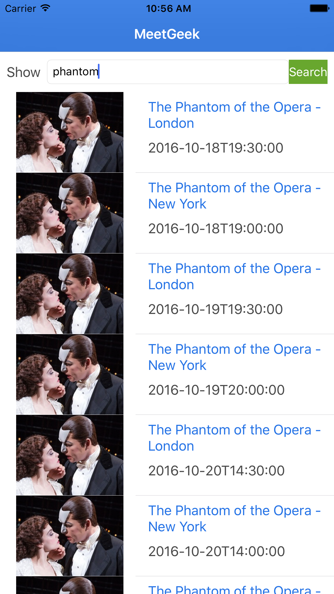
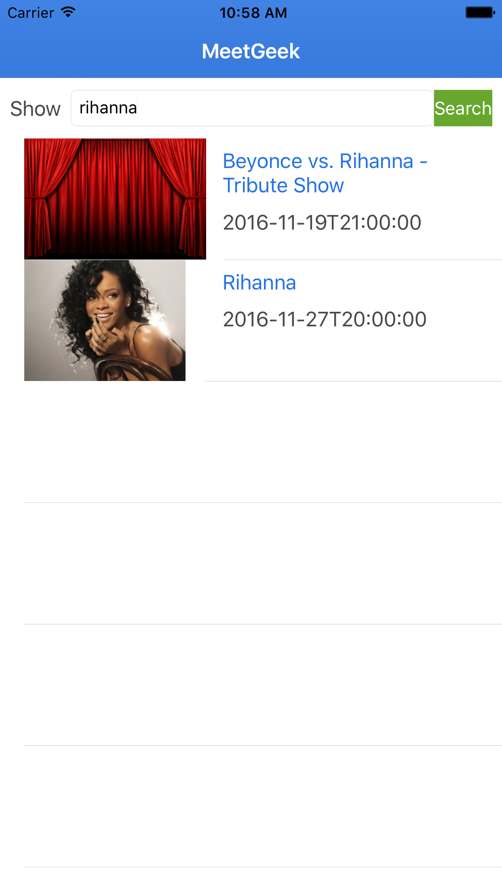
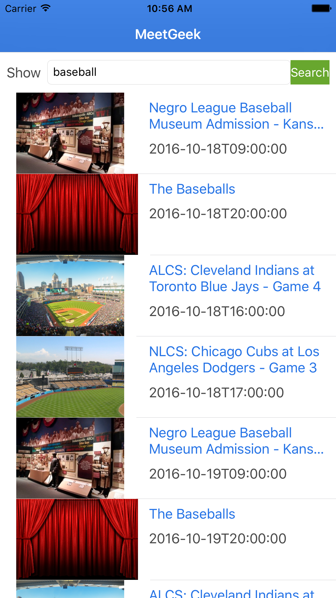
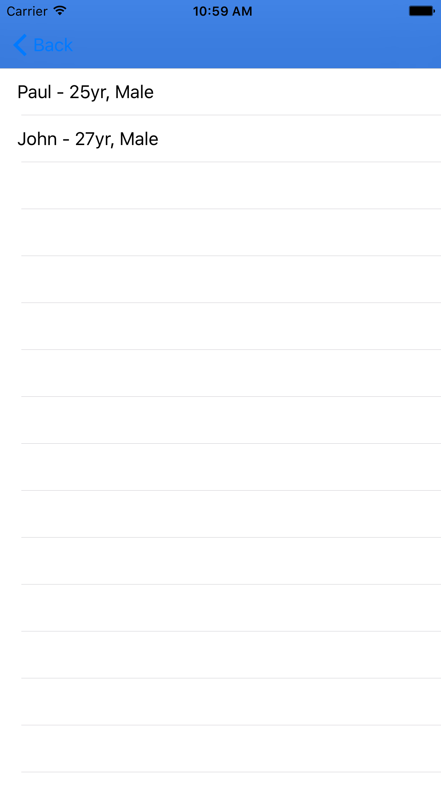
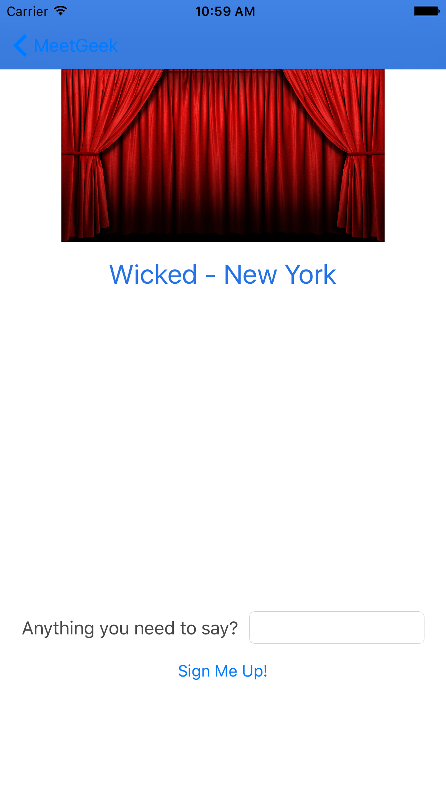

#Meet Geek won first prize of $1000 for best use of Seat Geek's API

This project was created for the Seat Geek G/url.code hackathon on October 15, 2016. The theme for the hackathon was live events. We had about 7 hours to come up with an idea, plan out the project, and implement the code.

Meet Geek wants to solve the problem of when you want to go to a live event but none of your friends want to go with you. With Meet Geek, you can match up with others in your situation. This is a great way to make friends with people who share the common bond of loving the team/band/show.

####My Contribution
- Came up with the idea for Meet Geek, created the wireframes and wrote out the specifications needed for the MVP.
- Wrote all of the Objective-C code and functionality of the app.
- Created the main table view which is where the user types in queries to send to the Seat Geek API and where the results from the request are also displayed when a response is received. Below are a few screenshots displaying that the API takes in all sorts of requests to find sports, concert, and theater events.

- Created the information screen where people can sign up to find a friend at an event, as well as the table view afterwards which displays the list of friends available to go to the event with you.

